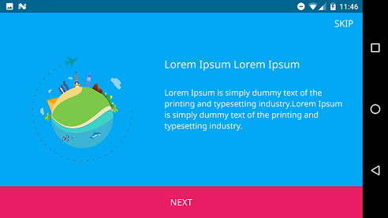
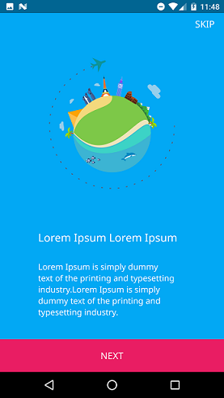

# Vertical-Intro

Vertical intro allows you to integrate vertical intro to your app


The current minSDK version is API level 14 Android 4.0 (ICE CREAM SANDWICH).

 

## Download sample [apk][0]
[0]: https://github.com/armcha/AutoLinkTextView/raw/master/screens/verticalIntro.apk

#YouTube demo

[](https://www.youtube.com/watch?v=VnQz75ekcSc)

#Installation
-----------------------
Gradle:
```groovy
compile 'com.github.armcha:Vertical-Intro:1.0.0'
```

# Setup and usage
-----------------------
## Step 1:
Your Activity must extend VerticalIntro and implement methods

```java public class TestActivity extends VerticalIntro```

## Step 2:

Add activity to manifest with defined theme:

```xml
<activity
android:name=".TestActivity"
android:theme="@style/VerticalIntroStyle" />
```

## Step 3:

Add items in init

```java
addIntroItem(new VerticalIntroItem.Builder()
                .backgroundColor(R.color.your_color)
                .image(R.drawable.my_drawable)
                .title("Lorem Ipsum Lorem Ipsum")
                .text("Lorem Ipsum is simply dummy text of the printing and typesetting industry." +
                        "Lorem Ipsum is simply dummy text of the printing and typesetting industry." +
                        "Lorem Ipsum is simply dummy text of the printing and typesetting industry.")
                .build());
```

Return color for last item bottom view background color
```java
 @Override
    protected Integer setLastItemBottomViewColor() {
        return R.color.color2;
    }
```

# Customize
## Note: You must do all customizations inside init method

Enable or disable skip button

```java setSkipEnabled(true); ```
----------------------------------

Enable or disable vibrate :vibration_mode: and set vibrate intensity
```java
setVibrateEnabled(true);
setVibrateIntensity(20);
```
----------------------------------

Set your texts
```java
setNextText("OK");
setDoneText("FINISH HIM");
setSkipText("GO GO");
```
----------------------------------

Set custom font
```java
setCustomTypeFace(Typeface.createFromAsset(getAssets(), "fonts/NotoSans-Regular.ttf"));
```
#

